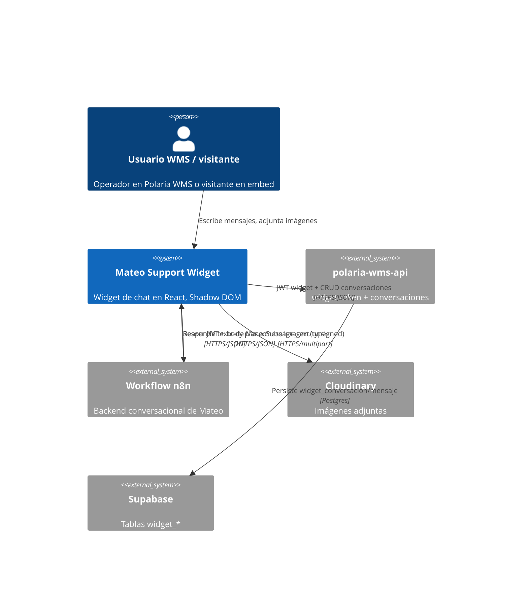
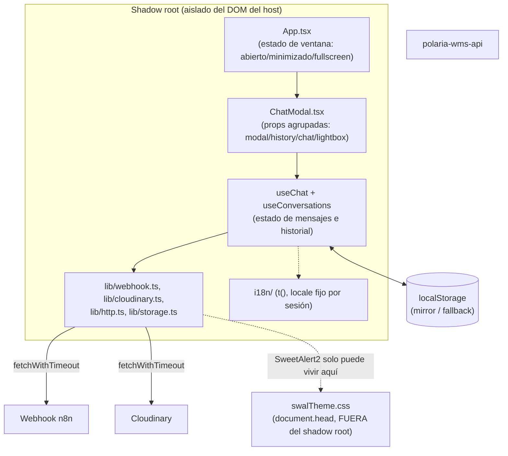
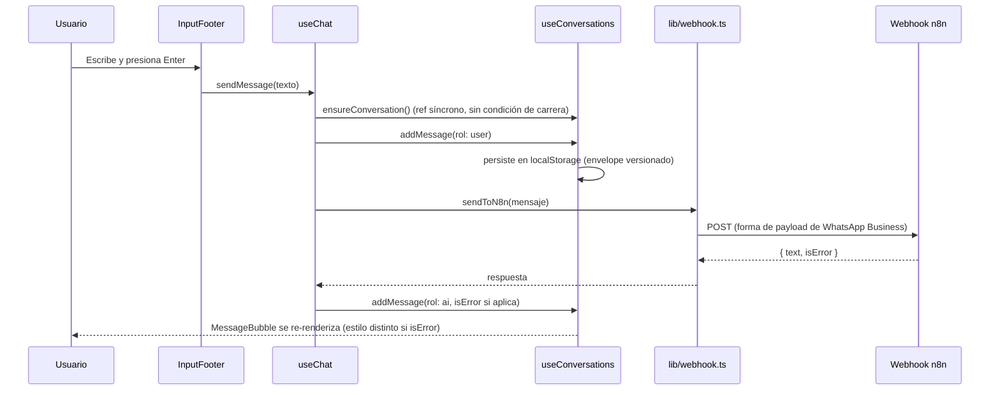

# Arquitectura — Mateo Support Widget

> Audiencia: desarrolladores que van a modificar o extender el widget. Asume conocimiento de React y TypeScript; no explica qué es un hook o un shadow root, pero sí por qué este proyecto los usa como los usa.

## Diagrama de contexto (C4 Nivel 1)

El widget como caja negra: quién lo usa y con qué sistemas externos habla.

## Diagrama de contenedores (C4 Nivel 2)

Los componentes internos principales y cómo se comunican.

## Por qué Shadow DOM (resumen — ver ADR-0001)

El widget se embebe en `polaria.tech`. Si su CSS (el preflight de Tailwind, que resetea estilos globalmente con `*`) se inyectara directo en el documento del sitio, rompería el CSS del sitio anfitrión y viceversa. `main.tsx` crea un shadow root sobre `#root` y renderiza React ahí adentro; el bundle CSS del widget se inyecta como `<style>` dentro de ese shadow root (import con `?inline`), de forma que el preflight solo afecta a elementos internos del widget.

**Excepción documentada:** SweetAlert2 (diálogos de alerta/confirmación) no puede vivir dentro de un shadow root — su función interna `getContainer()` está codificada a `document.body.querySelector(...)`, sin importar el `target` que se le pase (confirmado leyendo su código fuente, no es un bug de configuración nuestro). Por eso su tema visual (`src/swalTheme.css`) se importa aparte, sin `?inline`, y Vite lo inyecta en el `<head>` del documento normal — es la única porción de CSS del widget que intencionalmente no está aislada, acotada a clases con prefijo único (`mateo-swal-*`) para minimizar colisión con el sitio anfitrión.

## Capas del código (`src/`)

| Capa | Responsabilidad | Regla de dependencia |
|---|---|---|
| `components/` | Presentación (JSX + Tailwind). Reciben datos/callbacks por props. | No llaman a `fetch` ni tocan `localStorage` directamente. |
| `hooks/` | Estado y orquestación (`useChat`, `useConversations`) + utilidades de foco (`useFocusTrap`, `useFocusRestore`). | Pueden llamar a `lib/`, no a componentes. |
| `lib/` | Módulos puros o casi-puros: red (`webhook.ts`, `cloudinary.ts`, `http.ts`), persistencia (`storage.ts`), alertas (`alerts.ts`), utilidades (`format.ts`, `fileSignature.ts`). | No importan React. Testeados con Vitest. |
| `i18n/` | Diccionarios `es`/`en` + función `t()`. Locale resuelto una sola vez al cargar (`navigator.language`). | Usado tanto por componentes como por `lib/` — por eso es una función de módulo, no un hook/Context (ver ADR-0002). |
| `config.ts` / `types.ts` | Constantes, variables de entorno, tipos compartidos (`Message`, `Conversation`, `SelectedImage`). | Sin lógica. |

## Flujo de datos de un mensaje (resumen — detalle completo en `docs/FLUJOS_DE_NEGOCIO.md`)

## Decisiones arquitecturales

Ver `docs/adr/` para el detalle completo de cada decisión (contexto, alternativas evaluadas, consecuencias). Índice:

- **ADR-0001** — Shadow DOM para aislar estilos del sitio anfitrión
- **ADR-0002** — i18n propio (sin librería) en vez de react-i18next
- **ADR-0003** — Tema de SweetAlert2 fuera del shadow root
- **ADR-0004** — Generador de IDs sin `crypto.randomUUID()`
- **ADR-0005** — Refs síncronos para las condiciones de carrera de envío
- **ADR-0006** — Envelope de versión de esquema en `localStorage`

## Persistencia (`localStorage`)

El historial de conversaciones se guarda bajo la clave `mateo_chat_conversations`, envuelto en `{ schemaVersion, conversations }` (ver ADR-0006). Es una solución **temporal de prototipo**: es local al navegador (no sincroniza entre dispositivos), tiene un límite de tamaño (~5-10MB) y cualquiera con acceso al navegador puede leerlo. Antes de producción con usuarios reales a escala, este historial debería vivir en un backend real asociado al usuario — ver la nota en `src/lib/storage.ts` y el riesgo correspondiente en `docs/SEGURIDAD.md`.

## Multi-pestaña

`useConversations` escucha el evento nativo `storage` (se dispara en otras pestañas cuando una de ellas escribe en `localStorage`, nunca en la que escribió) y resincroniza su estado en memoria cuando detecta un cambio externo a la clave `mateo_chat_conversations`. No hay resolución de conflictos más allá de esto — sigue siendo "la última escritura gana", pero al menos todas las pestañas abiertas convergen al mismo estado poco después de cualquier escritura.
